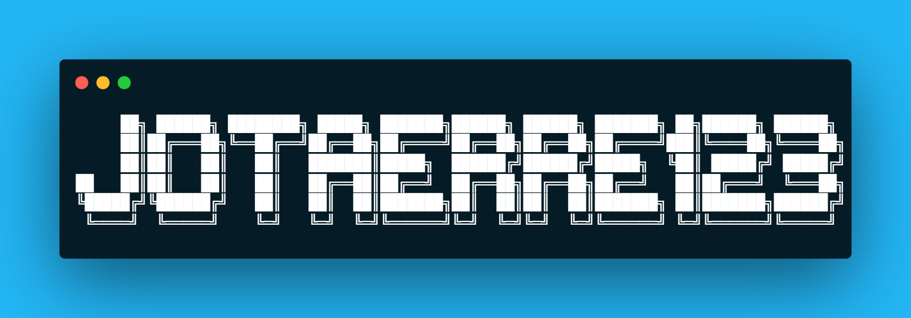

<h2 align="center">I'm Jaime, a Junior full-stack developer still learning, from Seville, Spain
</h2>

 

---

## Development environment 📊

---

## BackEnd 🛠

---
## Tools 🔧

---
## FrontEnd 🎨

---

## Databases 🛢

---

## All my route in GitHub 🧩

---

<h3 align="left">Connect with me: 🔗</h3>

